# TalentSuite Azure Architecture Diagram

This diagram reflects the Azure deployment shape defined by:

- [AppHost.cs](/Users/richard/development/talent-consulting/talentsuite-bidmanager/TalentSuite.AppHost/AppHost.cs)
- [private-network.bicep](/Users/richard/development/talent-consulting/talentsuite-bidmanager/TalentSuite.AppHost/Infrastructure/private-network.bicep)
- [application-insights.bicep](/Users/richard/development/talent-consulting/talentsuite-bidmanager/TalentSuite.AppHost/Infrastructure/application-insights.bicep)
- [sql-connection-policy.bicep](/Users/richard/development/talent-consulting/talentsuite-bidmanager/TalentSuite.AppHost/Infrastructure/sql-connection-policy.bicep)
- [infra/appgw/main.bicep](/Users/richard/development/talent-consulting/talentsuite-bidmanager/infra/appgw/main.bicep)

## Azure Deployment

```mermaid
flowchart TB
    internet[Internet / Users]
    dns[Public DNS / Custom Domains<br/>dev.talentsuite.uk<br/>dev-api.talentsuite.uk<br/>auth-dev.talentsuite.uk<br/>grafana-dev.talentsuite.uk]

    subgraph rg["Azure Resource Group: rg-<env>"]
        subgraph edge["Public Edge"]
            pip[Public IP<br/>pip-appgw-<env>]
            appgw[Application Gateway v2<br/>appgw-<env>]
            kv[Optional Key Vault<br/>TLS cert + app secrets]
        end

        subgraph frontend["Frontend Hosting"]
            staticweb[Azure Storage Static Website<br/>talentfrontend publish target]
        end

        subgraph observability["Observability"]
            appi[Application Insights<br/>appi-talentsuite-<env>]
        end

        subgraph messaging["Messaging and Storage"]
            sb[Azure Service Bus Namespace<br/>messaging]
            q1[Queue<br/>invite-user]
            q2[Queue<br/>bid-submitted]
            q3[Queue<br/>comment-saved-with-mentions]
            stmain[Azure Storage Account<br/>storage]
            stbid[Azure Storage Account<br/>bidcontentstorage]
            bidcontainer[Blob Container Connection<br/>bidstorage / bidlibrary]
        end

        subgraph data["Data Layer"]
            sqlpolicy[SQL Connection Policy<br/>Proxy]
            sql[Azure SQL Server<br/>sql]
            db1[Database<br/>talentconsultingdb]
            db2[Database<br/>keycloakdb]
        end

        subgraph vnet["Virtual Network: vnet-talentsuite-<env><br/>10.42.0.0/16"]
            subgraph subnet1["Subnet: aca-infrastructure<br/>10.42.0.0/23"]
                caedefault[ACA Environment<br/>aca-<env><br/>provisioned]
                caeprivate[ACA Environment<br/>aca-<env>-private]
            end

            subgraph subnet2["Subnet: private-endpoints<br/>10.42.2.0/24"]
                pepsql[Private Endpoint<br/>pep-sql-talentsuite-<env>]
            end

            subgraph subnet3["Subnet: talent-appgateway-subnet<br/>10.42.3.0/24"]
                appgwsubnet[App Gateway Subnet]
            end

            pdns[Private DNS Zone<br/>privatelink.database.windows.net]
        end

        subgraph apps["Azure Container Apps"]
            api[talentserver<br/>ASP.NET Core API]
            fn[talentfunctions<br/>Azure Functions container]
            kc[keycloak<br/>Identity provider]
            graf[grafana<br/>Monitoring UI]
        end
    end

    subgraph external["External Azure / SaaS Dependencies"]
        docint[Azure AI Document Intelligence]
        foundry[Azure AI Foundry Project]
        agent[Persistent Agent<br/>Agents:AgentId]
        gdrive[Google Drive]
        entra[Microsoft Entra ID]
    end

    internet --> dns --> pip --> appgw
    kv -. certificate .-> appgw
    appgwsubnet --- appgw

    appgw -->|dev.talentsuite.uk| staticweb
    appgw -->|dev-api.talentsuite.uk| api
    appgw -->|auth-dev.talentsuite.uk| kc
    appgw -->|grafana-dev.talentsuite.uk| graf

    sb --> q1
    sb --> q2
    sb --> q3
    stbid --> bidcontainer

    caeprivate --> api
    caeprivate --> fn
    caeprivate --> kc
    caeprivate --> graf

    pepsql --> sql
    pdns --> pepsql
    api --> db1
    kc --> db2
    sqlpolicy --> sql

    api --> sb
    fn --> sb
    fn --> stmain
    fn --> bidcontainer

    api --> appi
    fn --> appi
    kc --> appi
    graf --> appi

    api --> docint
    api --> foundry --> agent
    fn --> gdrive
    graf --> entra
```

## Notes

- The VNet is `10.42.0.0/16`.
- The private ACA environment `aca-<env>-private` is the runtime home for:
  - `talentserver`
  - `talentfunctions`
  - `keycloak`
  - `grafana`
- Azure SQL is reached privately through:
  - the `private-endpoints` subnet
  - a SQL private endpoint
  - a private DNS zone link for `privatelink.database.windows.net`
- Application Gateway is deployed into a separate subnet in the same VNet and fronts:
  - static frontend storage website
  - API container app
  - Keycloak container app
  - Grafana container app
- `storage` is the main infrastructure storage account.
- `bidcontentstorage` is the dedicated bid-library content storage account used by Functions.
- Service Bus queues used by the solution are:
  - `invite-user`
  - `bid-submitted`
  - `comment-saved-with-mentions`
- AI chat is routed from `talentserver` to:
  - an Azure AI Foundry project endpoint
  - a specific Persistent Agent identified by `Agents:AgentId`

## Resource Summary

### Public edge

- Application Gateway v2
- Public IP
- Optional Key Vault-backed TLS certificate
- Static website frontend storage endpoint

### Network

- VNet `vnet-talentsuite-<env>`
- Subnet `aca-infrastructure`
- Subnet `private-endpoints`
- Subnet `talent-appgateway-subnet`
- Private DNS zone `privatelink.database.windows.net`
- SQL private endpoint

### Compute

- Container App environment `aca-<env>`
- Container App environment `aca-<env>-private`
- Container App `talentserver`
- Container App `talentfunctions`
- Container App `keycloak`
- Container App `grafana`

### Data and platform

- Azure SQL server `sql`
- Azure SQL database `talentconsultingdb`
- Azure SQL database `keycloakdb`
- SQL connection policy `Proxy`
- Service Bus namespace `messaging`
- Storage account `storage`
- Storage account `bidcontentstorage`
- Application Insights `appi-talentsuite-<env>`

### External dependencies

- Azure AI Document Intelligence
- Azure AI Foundry project
- Persistent Agent
- Google Drive
- Microsoft Entra ID
