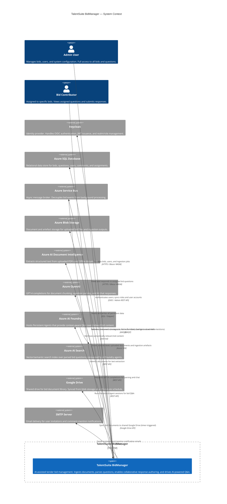

# TalentSuite BidManager — C4 Context Diagram

| Attribute | Value |
|-----------|-------|
| **Last updated** | 2026-05-14 |
| **Author** | Pablo Lorenzo |
| **Version** | 1.0 |
| **Format** | C4 Model — Context Level |

---

## System Purpose

TalentSuite BidManager is an AI-assisted bid management platform that enables organisations to upload, parse, and collaboratively respond to tender documents. It automatically extracts structured questions from uploaded PDFs and spreadsheets using Azure AI Document Intelligence and Azure OpenAI, provides intelligent Q&A over indexed bid content via Azure AI Foundry Persistent Agents, and orchestrates asynchronous workflows (user invitations, bid submissions, comment notifications) through Azure Service Bus.

---

## Context Diagram

> **Note:** The `TalentSuite BidManager` boundary contains four internal deployable units — a Blazor WASM SPA, an ASP.NET Core Web API, Azure Functions workers, and an Aspire AppHost — which are detailed in the [container-level diagram](talentsuite-c4-container.md).

---

## External System Descriptions

| System | Provider | Interaction Direction | Purpose |
|--------|----------|-----------------------|---------|
| **Keycloak** | Self-hosted / Quay.io | Bidirectional | OIDC login flow; Admin API for user/role sync |
| **Azure SQL Database** | Microsoft Azure | Bidirectional | Primary relational store for all domain data |
| **Azure Service Bus** | Microsoft Azure | Bidirectional | Pub/sub for async event processing |
| **Azure Blob Storage** | Microsoft Azure | Bidirectional | Raw document store and ingestion artefact store |
| **Azure AI Document Intelligence** | Microsoft Azure | Outbound | OCR and layout analysis for uploaded bid documents |
| **Azure OpenAI** | Microsoft Azure | Outbound | GPT-4 for document parsing and chat completions |
| **Azure AI Foundry** | Microsoft Azure | Outbound | Persistent Agent orchestration for contextual Q&A |
| **Azure AI Search** | Microsoft Azure | Internal (via AI Foundry) | Semantic search index backing the AI Foundry agents |
| **Google Drive** | Google | Outbound | Bid library sync — 30-minute timer trigger in Azure Functions |
| **SMTP Server** | Configurable | Outbound | Transactional email for invitations and comment mentions |

---

## Key Architectural Decisions at Context Level

**Authentication is externalised to Keycloak.** The application does not store credentials; it validates JWT Bearer tokens issued by Keycloak and maps `realm_access` / `resource_access` claims to roles. This keeps auth concerns separate and allows SSO across future services.

**Document AI is a two-stage pipeline.** Azure AI Document Intelligence handles raw extraction (OCR, layout), while Azure OpenAI handles semantic structuring (identifying questions, sections, metadata). Separating these allows each stage to be swapped or scaled independently.

**Async messaging decouples side-effects.** Events like user invitations and bid submissions are published to Azure Service Bus rather than handled synchronously. Azure Functions workers consume these queues, isolating email delivery and Google Drive sync from the user request path.

**Google Drive sync is one-way and timer-driven.** The platform treats Azure Blob Storage as the source of truth; Google Drive is a read-only distribution channel for stakeholders who prefer a familiar interface.

---

## References

- [CLAUDE.md](../../CLAUDE.md) — codebase conventions and service overview
- [Container diagram](talentsuite-c4-container.md) *(planned)*
- [arc42 document](talentsuite-arc42.md) *(planned)*
