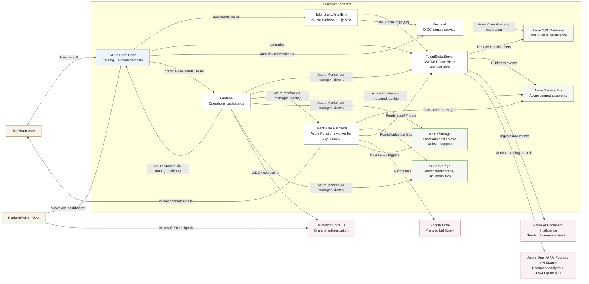

# TalentSuite C4 Container Diagram

This diagram shows the main runtime containers for TalentSuite in the Azure deployment shape.

## Container responsibilities

- `TalentSuite.FrontEnd`
  - User-facing SPA for bid ingestion, management, drafting, and review.
- `TalentSuite.Server`
  - Core application API, business workflow orchestration, persistence, and AI integration.
- `TalentSuite.Functions`
  - Background processing for bid-library export, Google Drive sync, invites, mentions, and health.
- `Keycloak`
  - User authentication and token issuance for the main application.
- `Grafana`
  - Operational dashboards backed by Azure Monitor and authenticated with Microsoft Entra ID.

## Data stores and platform services

- `Azure SQL Database`
  - Stores bid and user data.
- `Azure Service Bus`
  - Carries asynchronous commands and events between the API and Functions.
- `Azure Storage`
  - Main storage account supports static/frontend and Functions host infrastructure.
- `Azure Storage (bidcontentstorage)`
  - Dedicated bid library document storage.

## External dependencies

- `Azure AI Document Intelligence`
  - Extracts structure/content from uploaded tender documents.
- `Azure OpenAI / AI Foundry / AI Search`
  - Supports AI-assisted drafting, search, and bid reasoning flows.
- `Google Drive`
  - Receives mirrored copies of bid-library files.
- `Microsoft Entra ID`
  - Provides Grafana sign-in and optional admin role assignment.
